<div align="center">
  
  <h3 align="center">Código de conducta y Guía rápida</h3>
  <p align="center">
    Para poder contribuir deberás cumplir con el siguiente acuerdo
  </p>
</div>

## Tabla de Contenido<!-- omit in toc -->
- [Sobre Activando Ideas](#sobre-activando-ideas)
- [Consejos útiles para colaborar](#consejos-útiles-para-colaborar)
  - [¿Listo para contribuir?](#listo-para-contribuir)
- [Guía de contribución en GitHub](#guía-de-contribución-en-github)
  - [Tipos de contribuciones](#tipos-de-contribuciones)
    - [Reportar Bugs](#reportar-bugs)
    - [Corregir Bugs](#corregir-bugs)
    - [Implementa Features](#implementa-features)
    - [Escribe documentación](#escribe-documentación)
    - [Envia Feedback](#envia-feedback)
  - [Para contribuir en cada repositorio](#para-contribuir-en-cada-repositorio)
    - [Guía para enviar Pull Request](#guía-para-enviar-pull-request)
    - [Deploying](#deploying)
- [Guía de creación de proyectos](#guía-de-creación-de-proyectos)
  - [Creación](#creación)
    - [Atajos en los proyectos](#atajos-en-los-proyectos)
    - [Distribución de columnas](#distribución-de-columnas)
      - [Consideraciones sobre las columnas y el flujo de trabajo](#consideraciones-sobre-las-columnas-y-el-flujo-de-trabajo)
    - [Agregar al Backlog (Issues)](#agregar-al-backlog-issues)
    - [Enviar tarea a in progress (PR)](#enviar-tarea-a-in-progress-pr)
      - [Solucionar problemas de branches al generar PR](#solucionar-problemas-de-branches-al-generar-pr)
  - [Mover a testing (PR)](#mover-a-testing-pr)
  - [Mover a done (PR e Issues)](#mover-a-done-pr-e-issues)
  - [Cerrar el issue](#cerrar-el-issue)


# Sobre Activando Ideas

Activando Ideas es una comunidad que busca compartir y desarrollar recursos de código abierto en temas de Ciencia de Datos, Estadística, Inteligencia Artificial, Backend, Frontend, Cloud y DevOps con el objetivo de que puedan ser de ayuda al momento de desarrollar proyectos.

# Consejos útiles para colaborar

En activando ideas se realizó un post que se actualiza constantemente con algunos tips para usar GitHub, puedes revisarlo aquí:

https://activandoideas.com/blog/desarrollo/github-la-red-social-de-los-programadores

## ¿Listo para contribuir?

* Lee la públicación en Activando Ideas:
  * https://activandoideas.com/unete
* Únete a la discusión por discord para contribuir con nuevas ideas
[](https://discord.gg/2bsSMx)

# Guía de contribución en GitHub

¡Las contribuciones son bienvenidas y muy apreciadas! Todo ayuda, y siempre se le dará crédito. Puedes contribuir de muchas formas:

## Tipos de contribuciones

### Reportar Bugs

> ---
> Reporta el Bug, creando un issue en el repositorio
>
> Por favor incluye:
>
> * El nombre y la versión de su sistema operativo
> * Cualquier detalle sobre su configuración local que pueda ser útil para solucionar problemas.
> * Pasos detallados para reproducir el error..
> 
> ---

### Corregir Bugs

> ---
> Busca los issues con bugs. Todo lo etiquetado con "bug" y "help wanted" está abierto a quien quiera implementarlo.
> 
> ---

### Implementa Features

> ---
> Busca los issues para features. Todo lo tagueado con "enhancement" y "help wanted" está abierto a quien quiera implementarlo.
>
> ---

### Escribe documentación

> ---
> Cada proyecto siempre puede requerir más documentación, ya sea como parte de los documentos oficiales, en cadenas de documentos o incluso en la web en publicaciones de blogs, artículos, etc.
> 
> ---

### Envia Feedback

> ---
> La mejor forma de enviar feedback es creando un nuevo issue.
> Sí estás proponiendo un nuevo feature:
> 
> * Explique en detalle cómo funcionaría.
> * Mantenga el alcance lo más delimitado posible para que sea más fácil de implementar.
> * Recuerde que este es un proyecto impulsado por voluntarios y que las contribuciones son bienvenidas :)
> ---

## Para contribuir en cada repositorio

1. Realiza un Fork del repositorio.
2. Clonalo localmente
3. Realiza los pasos de instalación descritos en el repositorio
4. Crea un nuevo branch para desarrollar localmente:

```bash
  git checkout -b name-of-your-bugfix-or-feature
```

Ahora puedes hacer tus cambios localmente

5. Cuando haya terminado de realizar cambios, verifique que sus cambios pasen las pruebas de los linters y tests

6. Realiza un commit de tus cambios y haz un push push de tu rama a GitHub

```shell
    git add .
    git commit -m "Your detailed description of your changes."
    git push origin name-of-your-bugfix-or-feature
```

7. Envia tu pull request

### Guía para enviar Pull Request

Antes de enviar una solicitud de extracción, verifique que cumpla con estas pautas:

1. La solicitud de extracción debe incluir tests.
2. Si la solicitud de extracción agrega funcionalidad, los documentos deben actualizarse. Coloque su nueva funcionalidad en una función con una cadena de documentos y agregue la función al README.md
3. Los pull request deberían funcionar para las últimas versiones del lenguaje del repositorio
4. Asegurese de que las pruebas de CI se ejecuten correctamente

### Deploying

Un recordatorio para los mantenedores sobre cómo implementar.
Asegúrese de que todos sus cambios estén confirmados (incluida una entrada en CHANGELOG.md)

Describa la versión: major / minor / patch

```
git push
git push --tags
```

# Guía de creación de proyectos

## Creación
* Crear un repositorio o repositorios para el proyecto
* Crear un proyecto a nivel de organización 
* Poner un nombre claro y especifico, elige el template con automatizaciones
* Agrega los repositorios creados al proyecto, que van a ser dependientes

### Atajos en los proyectos

Presiona ``?`` para ver la lista de cosas que puedes hacer de forma rápida

### Distribución de columnas

Cada una de las tarjetas serán automatizadas según los criterios

* **Backlog: (Renombrada de ToDo)** Tareas por hacer en el Sprint definido por el equipo
  * Se agregan con un Issue
* **In progress:** Tareas que se están haciendo actualmente
  * se agrega al enviar un Pull request
* **Testing:** Tareas en proceso de pruebas
  * Se agrega al ser aprobado o enviado por un revisor
* **Done:** Tareas realizadas
  * Se ajusta cuando se hace Merge o se cierra el issue

<div align="center">
  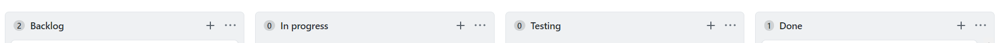
</div>

#### Consideraciones sobre las columnas y el flujo de trabajo

* **Los Issues son tareas generales** que se crean en el Backlog, lo que queda por hacer
* **Los Pull Request** son tareas especificas para cumplir con lo que requiere el issue creado y va cambiando de estado en el tiempo

### Agregar al Backlog (Issues)

En el repositorio correspondiente agregar un nuevo issue, está es la tarea general en la que pueden trabajar una o más personas y en ella generar los PR correspondientes para concretarlo

Para ello es importante asignar lo siguiente según sea necesario:
* **Título** claro para comprender claramente el objetivo de la tarea
* **Descripción** de la tarea incorporando mayores detalles
* **Etiquetas** para clasificar los proyectos e indicar de que se trata la tarea
* **Milestones** para establecer hitos/deadlines con fechas específicas a cumplir en el equipo
* **Proyecto** selecciona el proyecto al que pertenece la tarea para que se agregue al backlog

El issue deberá verse como sigue:

<div align="center">
  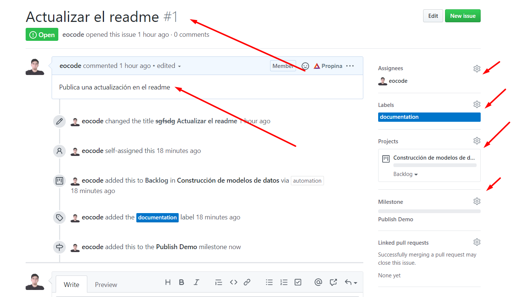
</div>

Al publicar el issue quedará como tarea en el proyecto

<div align="center">
  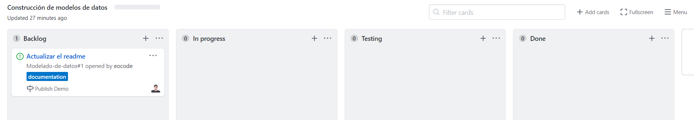
</div>

### Enviar tarea a in progress (PR)

Generar un nuevo pull request en otra rama

<div align="center">
  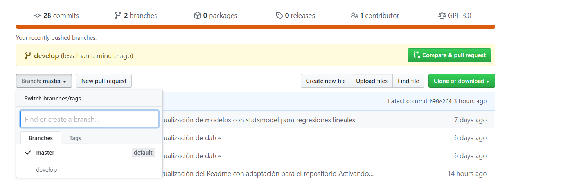
</div>

Se envia la petición para hacer merge, se puede asignar a la persona que va a hacer la revisión, para que se apruebe si el cambio puede influir con el trabajo de otra persona o si hace algo relaciones,  se hace referencia al issue al que pertenece, llenando los demás campos

<div align="center">
  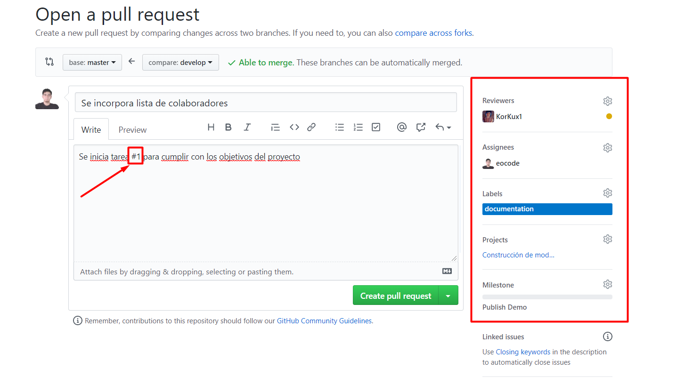
</div>

Se enlaza el issue al PR para generar el tracking y se genere como tarea dependiente

<div align="center">
  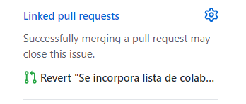
</div>

Una vez enviado y linkeado el PR se crea en In progress como algo que ya se está haciendo y que depende de un issue

<div align="center">
  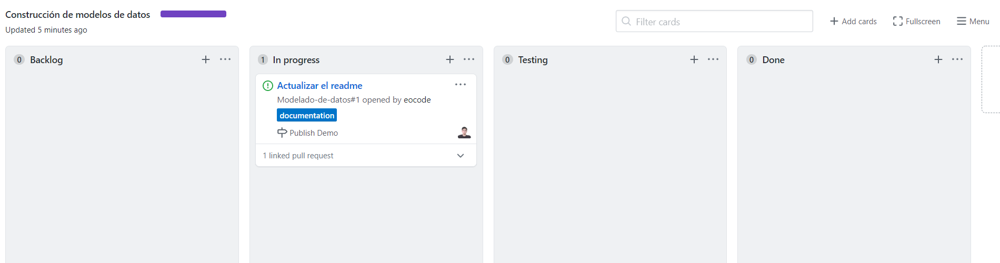
</div>

#### Solucionar problemas de branches al generar PR

Si no se siguen los pasos correctamente, se pueden duplicar branches, para eliminar innecesarios se puede hacer lo siguiente

En el repositorio seleccionar branches

<div align="center">
  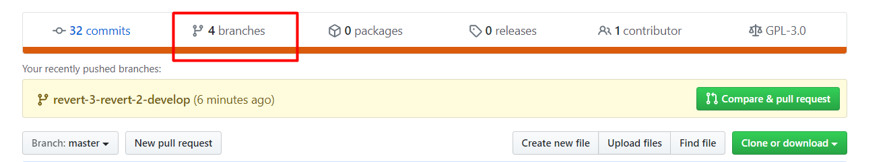
</div>

Eliminar los que se generaron innecesariamente

<div align="center">
  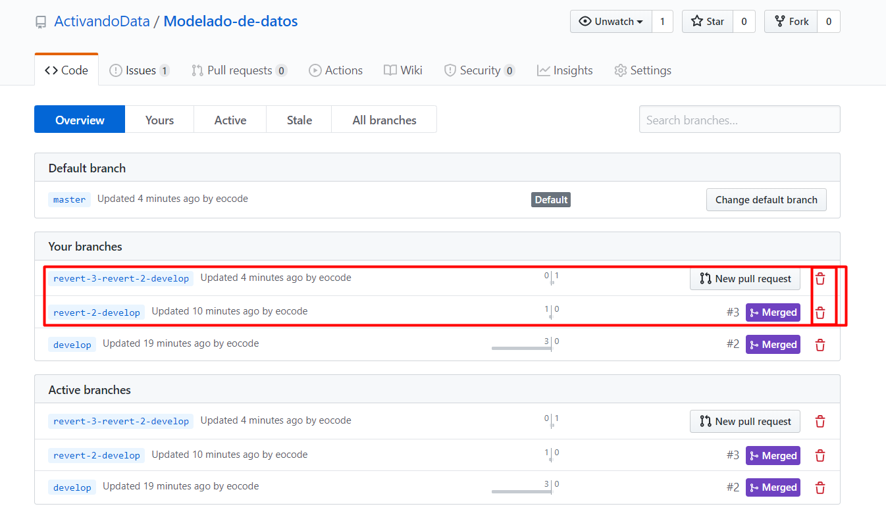
</div>

## Mover a testing (PR)

Tiene que pasar por las validaciones de alguien del equipo y aprobar el PR

<div align="center">
  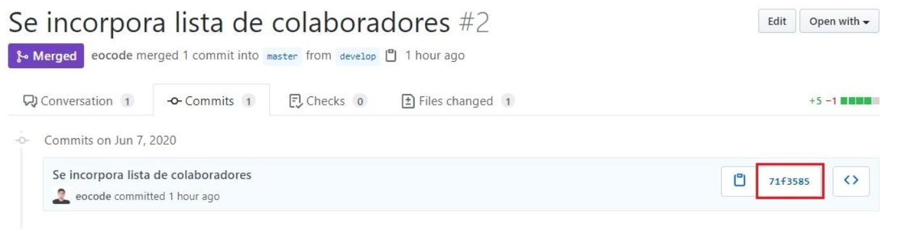
</div>

<div align="center">
  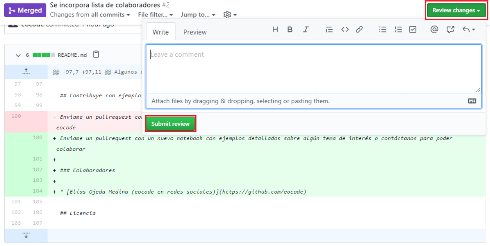
</div>

## Mover a done (PR e Issues)

Para que la tarjeta se mueva al final, se debe configurar para que se debe hacer merge 

* Dependiendo del cambio deberá ser aprobado, 
* Se deberan configurar acciones para automatizar algunas tareas y validaciones de código antes del merge para que pueda pasar

<div align="center">
  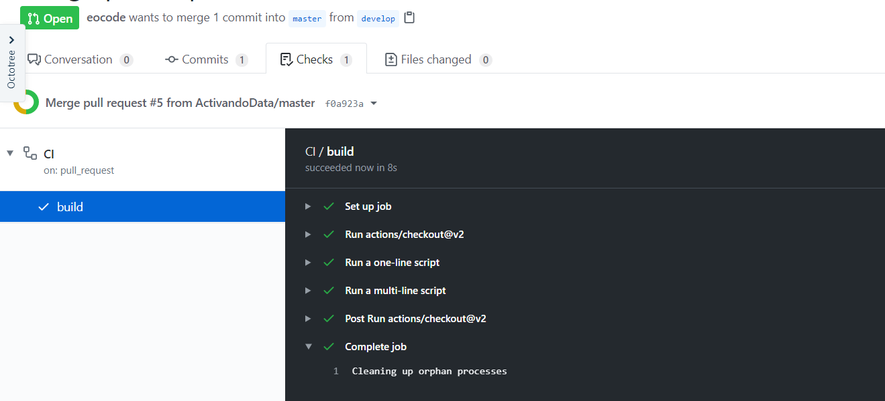
</div>

<div align="center">
  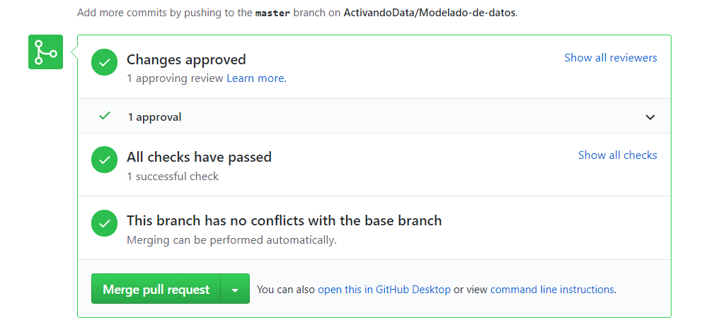
</div>

## Cerrar el issue

Al finalizar los pull request asociados al issue se deberá dar por terminado el issue

<div align="center">
  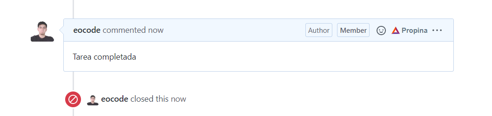
</div>

Una vez concluida el issue parará a Done

<div align="center">
  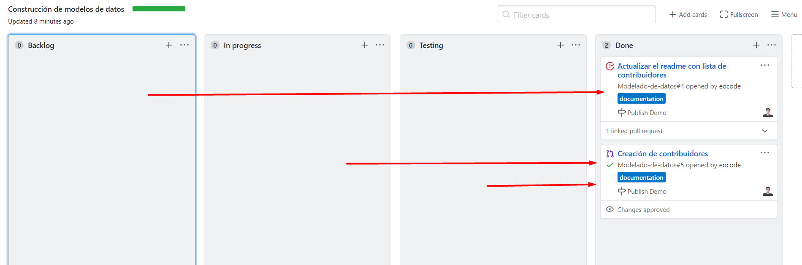
</div>
