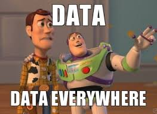

  
  <h3 align="center">Código de conducta y Guía rápida</h3>
  

    Para poder contribuir deberás cumplir con el siguiente acuerdo
  

## Tabla de Contenido<!-- omit in toc -->
- [Sobre Activando Ideas](#sobre-activando-ideas)
  - [Guía de colaboración en repositorios](#guía-de-colaboración-en-repositorios)
  - [Guía de creación de proyectos](#guía-de-creación-de-proyectos)
    - [Creación](#creación)
    - [Atajos en los proyectos](#atajos-en-los-proyectos)
    - [Distribución de columnas](#distribución-de-columnas)
      - [Consideraciones sobre las columnas y el flujo de trabajo](#consideraciones-sobre-las-columnas-y-el-flujo-de-trabajo)
    - [Agregar al Backlog (Issues)](#agregar-al-backlog-issues)
    - [Enviar tarea a in progress (PR)](#enviar-tarea-a-in-progress-pr)
      - [Solucionar problemas de branches al generar PR](#solucionar-problemas-de-branches-al-generar-pr)
  - [Mover a testing (PR)](#mover-a-testing-pr)
  - [Mover a done (PR e Issues)](#mover-a-done-pr-e-issues)
  - [Cerrar el issue](#cerrar-el-issue)

# Sobre Activando Ideas

Activando data es una organización con el fin de compartir contenido relacionado a modelos matemáticos, estadísticos y de machine learning para poder aprender y aplicar en el campo de la ciencia de datos

> Desde ejemplos detallados sobre distintos temas, hasta proyectos y templates en comunidad

  

## Guía de colaboración en repositorios

Al trabajar en un repositorio con otras personas de la organización, realiza lo siguiente:

* Pull
* Create branch
* Commit
* Pull again 
* Resolve conflicts
* Push
* Pull request

Evitemos historias de terror en la organización xD

  

## Guía de creación de proyectos

### Creación
* Crear un repositorio o repositorios para el proyecto
* Crear un proyecto a nivel de organización 
* Poner un nombre claro y especifico, elige el template con automatizaciones
* Agrega los repositorios creados al proyecto, que van a ser dependientes

### Atajos en los proyectos

Presiona ``?`` para ver la lista de cosas que puedes hacer de forma rápida

### Distribución de columnas

Cada una de las tarjetas serán automatizadas según los criterios

* **Backlog: (Renombrada de ToDo)** Tareas por hacer en el Sprint definido por el equipo
  * Se agregan con un Issue
* **In progress:** Tareas que se están haciendo actualmente
  * se agrega al enviar un Pull request
* **Testing:** Tareas en proceso de pruebas
  * Se agrega al ser aprobado o enviado por un revisor
* **Done:** Tareas realizadas
  * Se ajusta cuando se hace Merge o se cierra el issue

  

#### Consideraciones sobre las columnas y el flujo de trabajo

* **Los Issues son tareas generales** que se crean en el Backlog, lo que queda por hacer
* **Los Pull Request** son tareas especificas para cumplir con lo que requiere el issue creado y va cambiando de estado en el tiempo

### Agregar al Backlog (Issues)

En el repositorio correspondiente agregar un nuevo issue, está es la tarea general en la que pueden trabajar una o más personas y en ella generar los PR correspondientes para concretarlo

Para ello es importante asignar lo siguiente según sea necesario:
* **Título** claro para comprender claramente el objetivo de la tarea
* **Descripción** de la tarea incorporando mayores detalles
* **Etiquetas** para clasificar los proyectos e indicar de que se trata la tarea
* **Milestones** para establecer hitos/deadlines con fechas específicas a cumplir en el equipo
* **Proyecto** selecciona el proyecto al que pertenece la tarea para que se agregue al backlog

El issue deberá verse como sigue:

  

Al publicar el issue quedará como tarea en el proyecto

  

### Enviar tarea a in progress (PR)

Generar un nuevo pull request en otra rama

  

Se envia la petición para hacer merge, se puede asignar a la persona que va a hacer la revisión, para que se apruebe si el cambio puede influir con el trabajo de otra persona o si hace algo relaciones,  se hace referencia al issue al que pertenece, llenando los demás campos

  

Se enlaza el issue al PR para generar el tracking y se genere como tarea dependiente

  

Una vez enviado y linkeado el PR se crea en In progress como algo que ya se está haciendo y que depende de un issue

  

#### Solucionar problemas de branches al generar PR

Si no se siguen los pasos correctamente, se pueden duplicar branches, para eliminar innecesarios se puede hacer lo siguiente

En el repositorio seleccionar branches

  

Eliminar los que se generaron innecesariamente

  

## Mover a testing (PR)

Tiene que pasar por las validaciones de alguien del equipo y aprobar el PR

  

  

## Mover a done (PR e Issues)

Para que la tarjeta se mueva al final, se debe configurar para que se debe hacer merge 

* Dependiendo del cambio deberá ser aprobado, 
* Se deberan configurar acciones para automatizar algunas tareas y validaciones de código antes del merge para que pueda pasar

  

  

## Cerrar el issue

Al finalizar los pull request asociados al issue se deberá dar por terminado el issue

  

Una vez concluida el issue parará a Done

  

